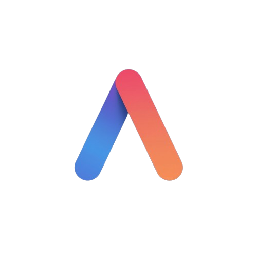

<p align="center">
  
</p>

[](https://python.org)
[](https://www.mozilla.org/en-US/MPL/2.0/)

[](https://t.me/ArcadiaAI_chatbot)


<h1 align="center">ArcadiaAI</h1>
<p align="center"><em>L'IA democratica e libera per tutti</em></p>

**ArcadiaAI** è un chatbot basato su intelligenza artificiale generativa, progettata per essere libero, accessibile e sovrano.
Creato da [Mirko Donato](https://github.com/Mirko-linux), ArcadiaAI unisce modelli principalmente open-source, interfacce leggere e backend distribuiti per offrire esperienze AI potenti e gratuite.

---

##  Visione

> “L’intelligenza artificiale deve essere un bene accessibile a tutti, ArcadiaAI nasce dal desiderio di democratizzare l'Intelligenza Artificiale"

ArcadiaAI nasce per sfidare i modelli proprietari e centralizzati.
Qui, ogni modulo è pensato per essere:

* **Open-source**
* **Senza barriere d’accesso**
* **Eseguibile dal browser**
* **Sostenibile e decentralizzato**


---
## Modelli principali

ArcadiaAI ha recentemente abbandonato l’uso diretto di API key pubbliche per modelli esterni, adottando una struttura **serverless e decentralizzata** tramite [Puter.js](https://puter.js.org).


| Modello principale       | Fallback 1           | Fallback 2           | Descrizione sintetica                          |
|--------------------------|----------------------|----------------------|------------------------------------------------|
| **GPT 5**                | GPT 5 Mini           | GPT 5 Nano           | Modello predefinito, versatile e potente       |
| **GPT 4o**               | GPT 4o Mini          | GPT 4.1 Nano         | Ottimizzato per dialoghi e ragionamento        |
| **Gemini 2.5 Flash**     | 2.5 Flash Lite       | Gemini 2.0 Flash     | Rapido, creativo, multilingua                  |
| **LLaMA 4 Maverick**     | LLaMA Scout          | LLaMA 3 8B           | Generazione e analisi, stile Meta              |
| **GPT o3**               | GPT o4 Mini          | GPT o3 Mini                | Sperimentale, leggero e reattivo               |

> ⚠️ *Nota:* I fallback vengono attivati automaticamente quando il modello principale raggiunge il limite di richieste o risorse. Questo garantisce **continuità**, **fluidità** e **zero interruzioni** nell’esperienza utente.

---

## Inizia Subito

Benvenuto in ArcadiaAI! Sei pronto a esplorare il futuro dell'intelligenza artificiale conversazionale? Iniziare è semplice e non richiede alcuna configurazione complessa.

### Utilizza ArcadiaAI Direttamente dal Browser

Per un'esperienza immediata, puoi accedere ad ArcadiaAI direttamente tramite il tuo browser. Non è necessario installare nulla:

1.  **Visita il nostro sito web:** [qui](https://arcadiaai.netlify.app/)
2.  **Scegli il tuo modello preferito:** Seleziona tra i nostri moduli disponibili, come **CES 1.5** per un'esperienza generale o **CES Plus** per interazioni più avanzate.
3.  **Inizia a chattare!** Digita le tue domande o richieste e scopri la potenza di ArcadiaAI.

### Esegui ArcadiaAI Localmente (per sviluppatori)

Se sei uno sviluppatore e desideri contribuire o personalizzare ArcadiaAI, puoi clonare il repository ed eseguirlo localmente.

#### Prerequisiti

Assicurati di avere installato:

* **Node.js** (versione 18 o superiore)
* **npm** (solitamente incluso con Node.js)
* **Git**

#### Passi per l'installazione e l'avvio

1.  **Clona il repository:**

    ```bash
    git clone https://github.com/Mirko-linux/Nova-App.git
    cd Nova-App/ArcadiaAI
    ```

2.  **Installa le dipendenze:**

    ```bash
    npm install
    ```

3.  **Avvia l'applicazione:**

    ```bash
    npm start
    ```

    Questo avvierà l'applicazione in modalità di sviluppo. Potrai accedere al chatbot tramite il tuo browser all'indirizzo `http://localhost:3000` (o la porta indicata).

---

## Fork e Contribuisci

Se sei uno sviluppatore e desideri contribuire al progetto ArcadiaAI, personalizzare i moduli o integrare nuove funzionalità, ti invitiamo a effettuare il **fork del repository**.

### Prerequisiti per il Fork

Per poter lavorare efficacemente sul codice, assicurati di avere familiarità con:

* **Node.js** e **npm**: per gestire le dipendenze del progetto.
* **Git**: per clonare, committare e inviare le modifiche.
* **Concetti base di sviluppo web**: HTML, CSS, JavaScript per le interfacce e i backend.

### Come Effettuare il Fork e Iniziare

1.  **Effettua il Fork del Repository:**
    Naviga alla pagina GitHub di [ArcadiaAI](https://github.com/Mirko-linux/Nova-App/tree/main/ArcadiaAI) e clicca sul pulsante "**Fork**" in alto a destra. Questo creerà una copia del repository sul tuo account GitHub.

2.  **Clona il Tuo Fork Localmente:**
    Dal tuo terminale, clona la tua copia del repository.

    ```bash
    git clone https://github.com/Mirko-linux/Nova-App.git
    ```

    Poi naviga nella cartella di ArcadiaAI:

    ```bash
    cd Nova-App/ArcadiaAI
    ```

3.  **Installa le Dipendenze:**
    Una volta nella directory del progetto, installa tutte le dipendenze necessarie:

    ```bash
    npm install
    ```

## Documentazione legale

- [Termini di Servizio](docs/tos.md)
- [Privacy Policy](docs/Policy.md)
- [Domande Frequenti](docs/faq.md)

---

## Licenza

Questo progetto è distribuito sotto la [Mozilla Public License 2.0](https://www.mozilla.org/en-US/MPL/2.0/).

---
