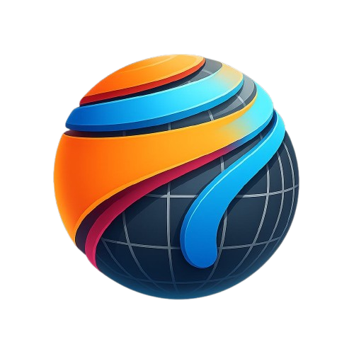
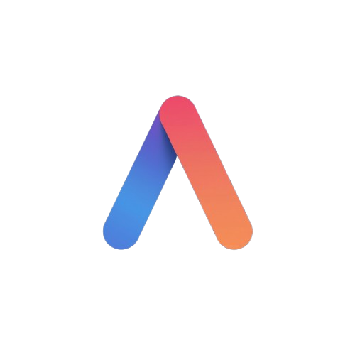
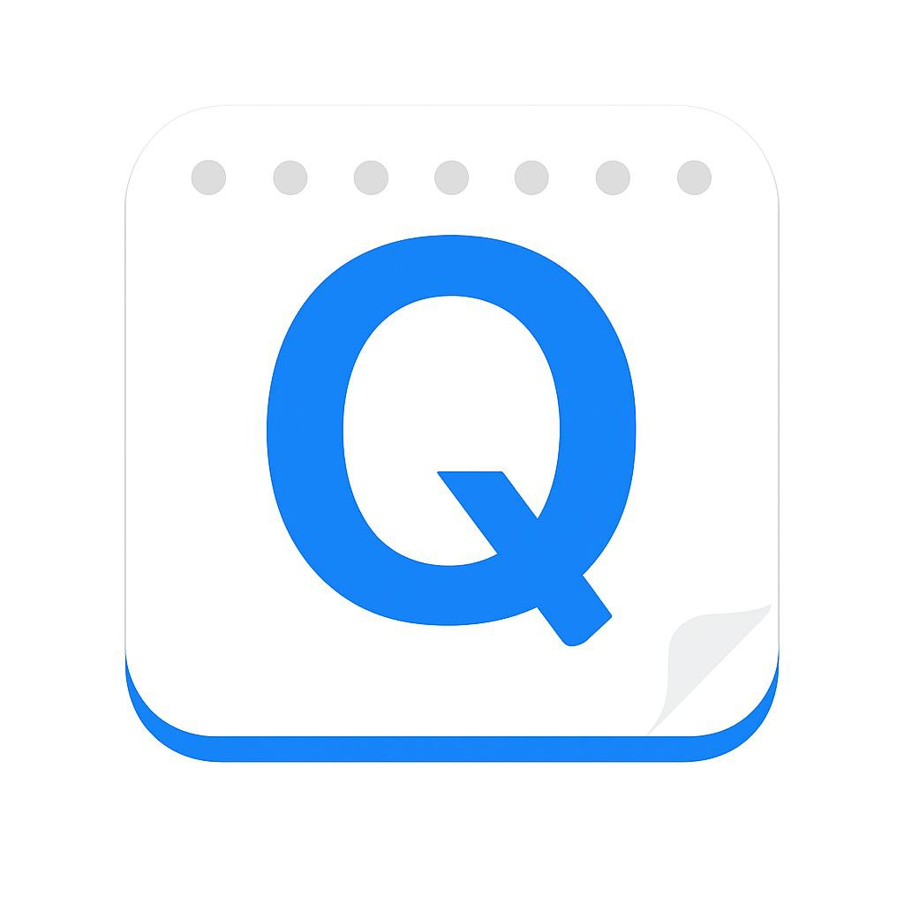

# Nova-App 
<!-- Nova-App -->

  
  
  

Nova App è una raccolta di applicazioni sviluppate in Python, pensate per offrire strumenti essenziali e potenti. Ogni app ha un proprio scopo e un README dedicato con tutti i dettagli.
L'intero progetto è mantenuto è sviluppato in Italia da Mirko Yuri Donato, come parte del progetto  [*Repubblica di Arcadia*](https://repubblicadiarcadia.it/).

## Le nostre App:
- **Nova Surf**: browser web scritto in PyQt5
- **Nova QuickNote**: editor di testo completo
- **ArcadiaAI**: chatbot AI basato su vari LLM
- **Nova Calc**: calcolatrice avanzata
- **Nova Pocket**: Progetto ancora in fase di sviluppo 
- **Mini Tool**: componenti leggeri per progetti in python

## Nova Surf
Nova Surf è un browser molto leggero scritto in Python, mediante l'uso delle librerie PyQt e PyQtWebEngine.
Esso nasce dall'idea di unire il design e la comodità di *Mozilla Firefox* alla compatibilità e la versatilità di *Google Chrome*.
Il browser ha già alcune estensioni in via di rilascio, tra cui il *Firefox Relay*, *Servizi Leonia+* e un *Ad-Block*. Nova Surf è ancora in fase di sviluppo, quindi il codice sorgente potrebbe essere divrso da quello reso pubblico.

## ArcadiaAI

ArcadiaAI è un chatbot basato su Intelligenza Artificiale generativa libero e open source. Lo scopo dell'IA è quello di rendere accessibile questo mondo a tutti gli utenti, indistintamente dal denaro.
L'intero codice sorgente è rilasciato sotto la GNU GPL v3.0+, ad eccezione delle estensioni (Gli ArcadiaAI Addon), che possono avere licenze diverse a scelta dell'autore.
ArcadiaAI usa diversi Modelli, tra cui: la linea CES, i modelli ufficiali di ArcadiaAI, basati su Google Gemini; LLaMA, usato come base per il nuovo CES 360e; Mistral, noto LLM dell'omonima società francese; e infine DeepSeek, disponibili entrambe le versione v3 e R1

ArcadiaAI svolge i compiti analoghi alle altre IA, come:
-  La ricerca su Internet
-  Il supporto di allegati
-  La generazione di Immagini

Inoltre, ArcadiaAI ha integrato moltissime tool esterni, come Open Street Maps, OpenWeatherMap e molte repository (Snap, Flathub, F-Droid e Winget)

## Nova QuickNote
Nova QuickNote è un editor di testo molto completo, che nasce dall'idea di unire un software per la videoscrittura e uno per l'elaborazione di codice sorgente. Inoltre, l'editor ha ArcadiaAI integrato per facilitare lo svolgere dei compiti.
Il programma è un fork di *GNU Gedit* ed è sotto la Licenza GNU GPL v3.0+

## Nova Pocket

Nova Pocket è un servizo di cloud storage open source e decentralizzato basato sulla rete peer-to-peer progettato per essere illimitato.
A differenza dei normali servizi - come Google Drive o Dropbox - in Nova Pocket il file vieene frammentato in pochissimi megabyte e diviso tra gli altri utenti 
